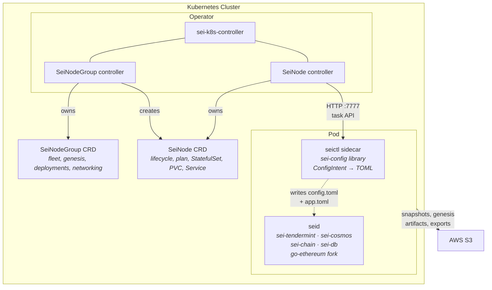
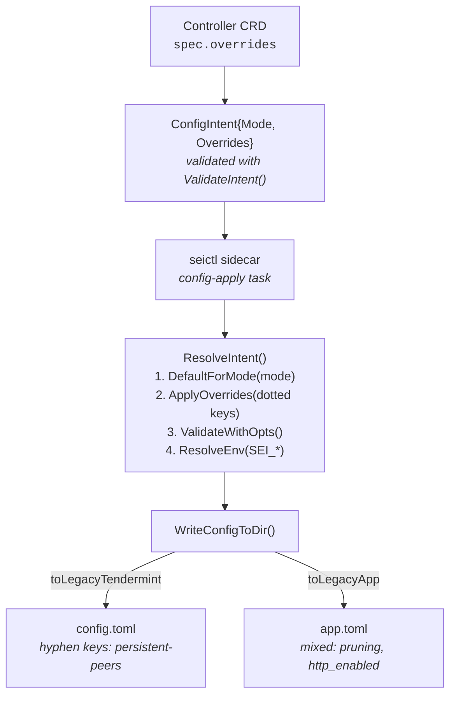
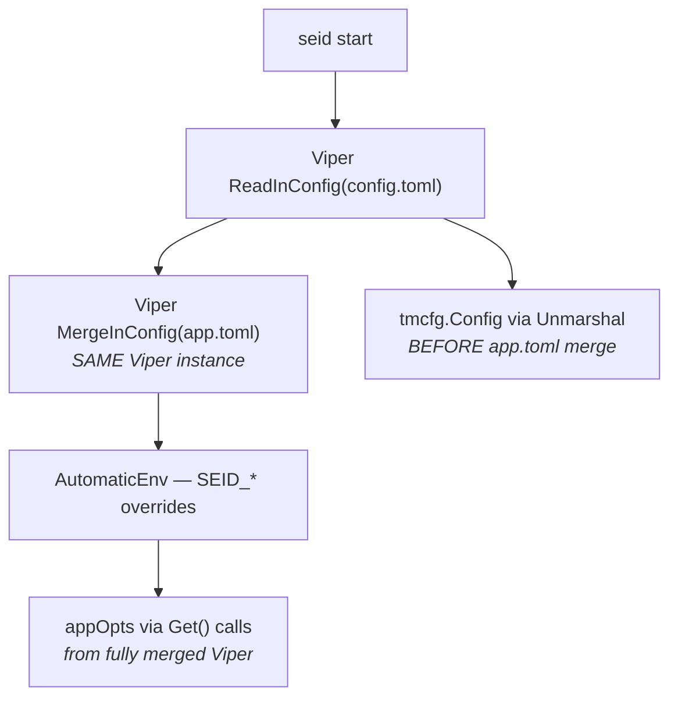
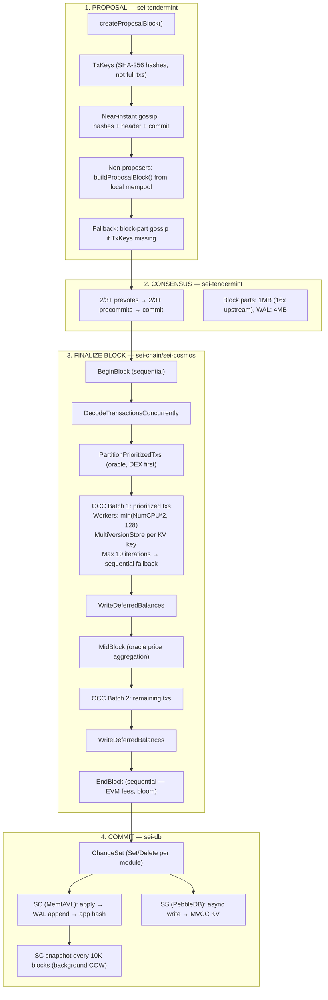
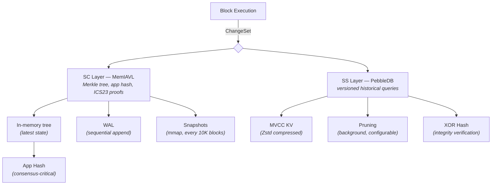
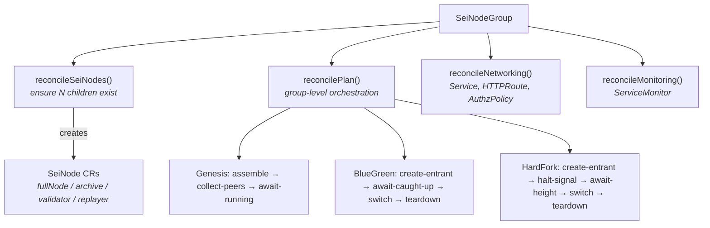
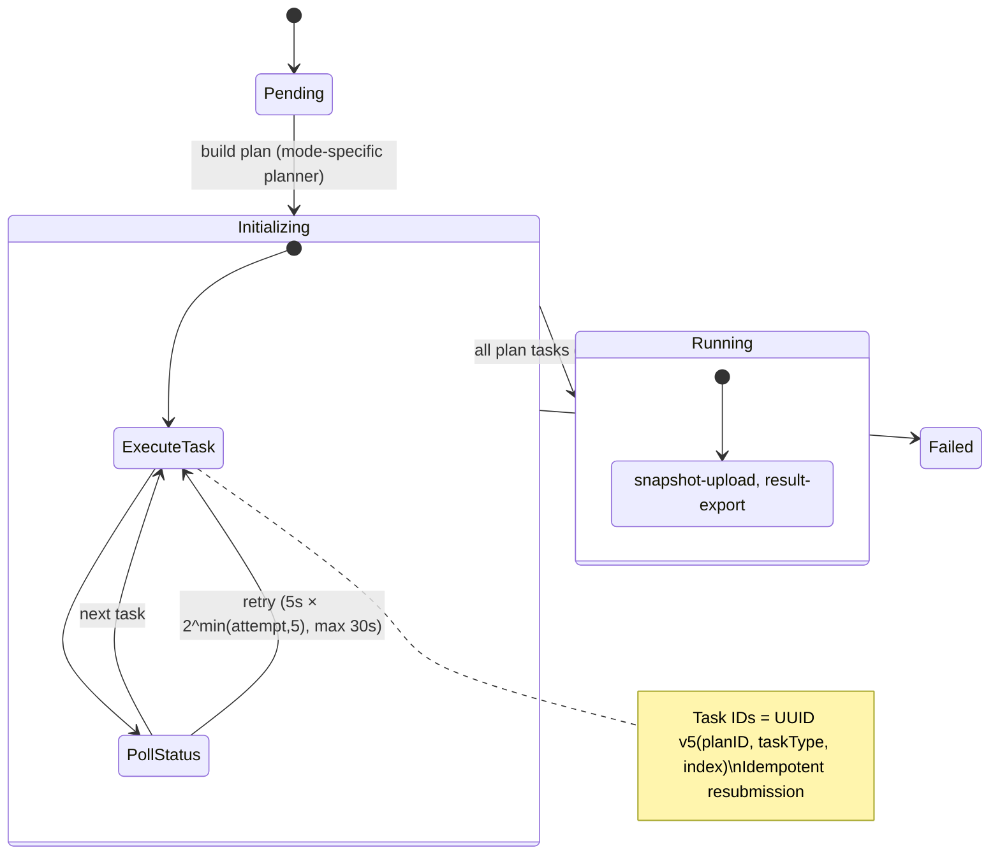
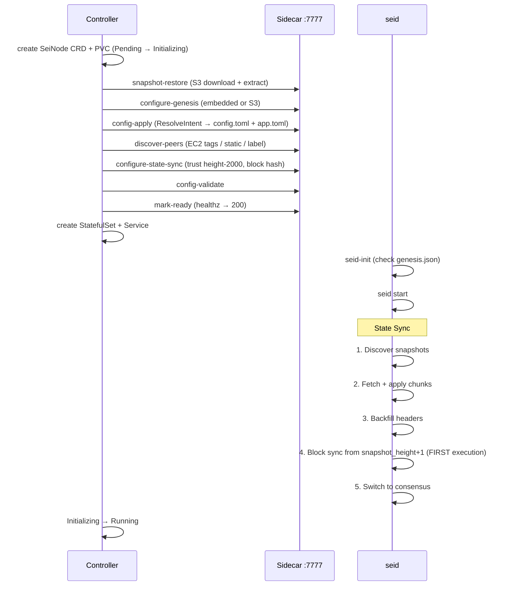

# Archon — Sei Architecture Reference

Dense cross-cutting reference synthesized from 12 research memories. Read this first for architectural context -- drill into specific memories for implementation detail.

## System Map

**Control flow:** Controller creates CRDs -> reconciles plans -> submits tasks to sidecar -> sidecar writes config/genesis -> seid reads TOML files via Viper -> node runs.

**Data flow at runtime:** Tendermint receives txs via P2P -> proposes blocks (TxKey gossip) -> ABCI FinalizeBlock -> OCC parallel execution -> MemIAVL (SC) commit + PebbleDB (SS) async write -> app hash returned to consensus.

## Configuration Pipeline

**Critical insight:** sei-config is NOT a dependency of seid. It is a companion library consumed only by the sidecar and controller. The sidecar generates TOML files that seid reads through its standard Viper-based loading. The controller never calls DefaultForMode or ApplyOverrides directly -- it constructs intents and the sidecar resolves them.

**Key conversion:** sei-config uses underscores internally (`persistent_peers`), but writes hyphens to config.toml (`persistent-peers`) via legacy struct tags. seid's TOML parser expects hyphens for Tendermint fields and mixed conventions for app.toml.

## Block Lifecycle

A block's journey from proposal through storage, connecting consensus, execution, and storage:

## Storage Architecture

**SC internals:** MemIAVL keeps the full IAVL tree in memory. PersistedNodes are zero-copy references into mmap'd flat files (48 bytes/node). PersistedNode.Get() uses binary search over sorted leaf arrays -- O(log n) with zero deserialization. Hashing is identical to standard cosmos/iavl (SHA-256), ensuring seamless swap.

**SS internals:** PebbleDB stores versioned KV pairs with MVCC encoding: `<store_prefix><key>\x00[<version>]<len>`. Deletions are tombstones. Get at version V: SeekLT(key, V+1), check tombstone.

**Query routing:** Latest version reads from SC (memory speed). Historical queries without proofs route to SS (PebbleDB). Historical queries with proofs (IBC, light client) reconstruct from SC snapshot + WAL replay -- expensive.

**Pruning per node mode:**

| Mode | SC Snapshots | SS KeepRecent | MinRetainBlocks | Cosmos Pruning |
|------|-------------|---------------|-----------------|----------------|
| Validator | keep 1 old | SS disabled | 0 (all) | nothing |
| Full | keep 1 old | 100,000 | 100,000 | nothing |
| Archive | keep 1 old | 0 (all) | 0 (all) | nothing |
| Seed | keep 1 old | SS disabled | 0 | everything |

**State sync snapshot creation** requires `pruning != everything` and both SC and SS enabled when `snapshot_interval > 0`. The sei-config helper `SnapshotGenerationOverrides()` sets `pruning=nothing, snapshot_interval=2000`.

## EVM Integration Points

The EVM is a native Cosmos SDK module (`x/evm`), not a sidechain:

**Shared balances:** EVM balances ARE Cosmos bank module balances. `1 usei = 10^12 wei`. The sei-cosmos fork adds `GetWeiBalance()`/`AddWei()`/`SubWei()` to the bank keeper for sub-usei precision. No separate EVM token ledger exists.

**OCC participation:** EVM txs flow through the same OCC scheduler as Cosmos txs. The EVM StateDB writes through Cosmos KVStore, which is wrapped by VersionIndexedStore during OCC. Per-tx coinbase addresses (`evm_coinbase` + txIndex) avoid fee collector contention -- the same pattern as the deferred bank cache.

**Pointer contracts:** Five pointer directions bridge EVM and Cosmos assets bidirectionally. ERC-20 pointers for native denoms call the bank precompile (0x1001). CW20 pointers call the wasmd precompile (0x1002). Each pointer has a version; highest version wins via reverse iterator.

**11 precompiles** at fixed addresses (0x1001-0x100B): bank, wasmd, json, addr, staking, gov, distribution, oracle, ibc, pointerview, pointer. These give Solidity contracts direct access to the full Cosmos module set.

**Cross-VM guard:** EVM->CW->EVM re-entrancy is explicitly blocked (`ctx.IsEVM()` check), simplifying concurrency semantics under OCC.

**Gas conversion:** `sei_gas = evm_gas * PriorityNormalizer` (default 1). Ante handler sets infinite gas, EVM manages gas internally, post-execution converts back and charges the Cosmos meter.

## Operator Control Plane

**Key design:** The controller never writes config files or runs seid commands directly. It submits structured tasks to the sidecar HTTP API at `http://{name}-0.{name}.{namespace}.svc.cluster.local:7777`. The sidecar executes tasks using the same Go SDK functions as `seid init`/`seid gentx`/`seid collect-gentxs` -- in-process, no shell-outs.

## Node Bootstrap Sequence

End-to-end for a full node with S3 snapshot, peers, and state sync:

**Genesis ceremony variant:** Each validator runs generate-identity -> generate-gentx -> upload-genesis-artifacts to S3. The group assembler collects all gentxs via S3 (calling the same `genutil.GenAppStateFromConfig` as `seid collect-gentxs`), uploads final genesis.json + peers.json. Each node's configure-genesis task retries up to 180 times (30 min) until the assembled genesis is available.

**State sync details:** One-shot operation (LastBlockHeight must be 0). Snapshots are ranked by height/peer-count/format. Light client verifies trust chain via pure signature checking -- no block execution. Trust period is security-only (does NOT cause re-execution even across upgrade boundaries). Block execution begins only at snapshot_height+1 during block sync.

## Cross-Domain Gotchas

**OCC + EVM fee collection:** The deferred bank cache (`DeferredCachePrefix / moduleAddr / txIndex / denom`) is essential for EVM parallel execution. Without it, every fee-paying tx would conflict on the fee collector balance. Per-tx coinbase addresses (`evm_coinbase` + txIndex) solve the same problem from the EVM side. Both are flushed after each OCC batch.

**Archive mode is a sei-config abstraction:** Tendermint only understands `validator/full/seed`. Archive stores `mode=archive` in `[sei]` section of `app.toml`; config.toml sees `mode=full`. On read, `[sei].mode` takes precedence.

**TxKey gossip requires mempool pre-population:** When `gossip-tx-key-only=true` (default), non-proposers must have transactions in their mempool before the proposal arrives. Missing TxKeys fall back to full block-part gossip, tracked by the `ProposalMissingTxs` metric.

**Trust period is security-only:** Setting `trust_period=9999h` (common in operator manifests) weakens light client security but causes no functional issues. The light client never executes blocks -- it only verifies signatures. Even if the trust height is before an upgrade, no re-execution occurs.

**MemIAVL lives in sei-db, not sei-iavl:** `sei-iavl` is a fork of cosmos/iavl used only for type definitions (`ChangeSet`, `ProofInnerNode`) and hash compatibility testing. MemIAVL is a completely separate implementation in `sei-db/sc/memiavl/` that produces identical Merkle hashes.

**seictl genesis ops are in-process SDK calls:** The sidecar calls `genutil.InitializeNodeValidatorFilesFromMnemonic`, `genutil.GenAppStateFromConfig`, etc. directly as Go function calls. No shell-outs to `seid`. This allows seictl to be built with `CGO_ENABLED=0`.

**Two separate env var systems:** sei-config's `ResolveEnv()` uses `SEI_*` prefix and runs before writing files. seid's Viper uses `SEID_*` prefix at runtime. These are independent and can conflict if both are set.

**Snapshot generation constraint:** When SeiDB SC is enabled with `snapshot_interval > 0`, SS must also be enabled (enforced at startup). Cannot use `pruning=everything` with `snapshot_interval > 0` (validation error).

**Zero-copy lifetime hazard:** MemIAVL's `ZeroCopy=true` returns mmap pointers. If a background snapshot rewrite replaces the mapped file, accessing those slices causes a segfault. Callers must not retain zero-copy values beyond the current block.

**GigaExecutor is config-only:** The `giga_executor` section exists in sei-config but has zero implementation in sei-chain v0.0.38. It is a stub for a future execution engine that may subsume OCC.

**Single Viper instance for both TOML files:** config.toml is loaded with `ReadInConfig()`, then app.toml with `MergeInConfig()` into the same Viper. Tendermint config is unmarshalled BEFORE the merge; app config is accessed via individual `Get()` calls on the fully merged Viper. Key collisions between files: app.toml wins.

## Memory Index

| # | File | Domain | Covers | Read when... |
|---|------|--------|--------|-------------|
| 1 | `node-configuration/sei-config-package.md` | Config | SeiConfig struct, ConfigIntent, mode defaults, field registry, validation rules, well-known chains | You need config field names, defaults, validation logic, or override syntax |
| 2 | `node-configuration/seid-config-consumption.md` | Config | seid startup sequence, Viper loading, config.toml/app.toml merge, env var precedence | You need to understand how seid reads config at runtime |
| 3 | `node-configuration/node-types.md` | Config | Four node modes (validator/full/archive/seed), per-mode overrides, API matrix, pruning strategies | You need mode-specific behavior or feature matrix |
| 4 | `node-configuration/state-sync-mechanics.md` | Consensus | State sync phases (snapshot/backfill/block-sync), light client verification, trust parameters | You need state sync internals or bootstrap behavior |
| 5 | `sei-consensus/tendermint-fork-delta.md` | Consensus | TxKey gossip, ABCI changes, EVM mempool, DB sync, self-remediation, block part sizing | You need consensus-layer changes vs upstream Tendermint |
| 6 | `sei-execution/occ-parallel-execution.md` | Execution | OCC scheduler, MultiVersionStore, conflict detection, deferred bank cache, retry strategy | You need parallel execution internals or conflict debugging |
| 7 | `sei-execution/giga-autobahn-wip.md` | Execution | GigaExecutor config stub, Autobahn (no code), current OCC status | You need future execution engine plans |
| 8 | `sei-storage/seidb-architecture.md` | Storage | SC/SS two-layer design, commit path, async writes, pruning, snapshot mechanics, PebbleDB MVCC | You need storage architecture or query routing |
| 9 | `sei-storage/memiavl-internals.md` | Storage | MemIAVL node types, mmap layout, COW, snapshot format, WAL, hash compatibility | You need MemIAVL implementation details |
| 10 | `sei-evm/parallel-evm.md` | EVM | EVM module, pointer contracts, precompiles, OCC integration, shared bank balances, gas metering | You need EVM integration or cross-VM behavior |
| 11 | `sei-operations/sei-k8s-controller.md` | Operations | CRD types, ownership model, plan system, deployment strategies, RBAC, platform config | You need controller architecture or task orchestration |
| 12 | `sei-operations/seictl.md` | Operations | CLI commands, sidecar HTTP API, task catalog, bootstrap sequence, genesis ceremony | You need sidecar behavior or task parameters |
